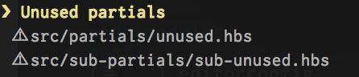

# assemble-unused-partials

[](https://github.com/makotot/assemble-unused-partials)
[](https://github.com/makotot/assemble-unused-partials)
[](https://github.com/makotot/assemble-unused-partials)
[](https://github.com/makotot/assemble-unused-partials)
[](https://github.com/makotot/assemble-unused-partials)

> Check & output the unused [assemble](http://assemble.io/) partials




## Install
```sh
$ npm i --save-dev assemble-unused-partials
```

## Register
```js
assemble: {
  options: {
    plugins: ['assemble-unused-partials']
  }
}
```


## License

MIT

